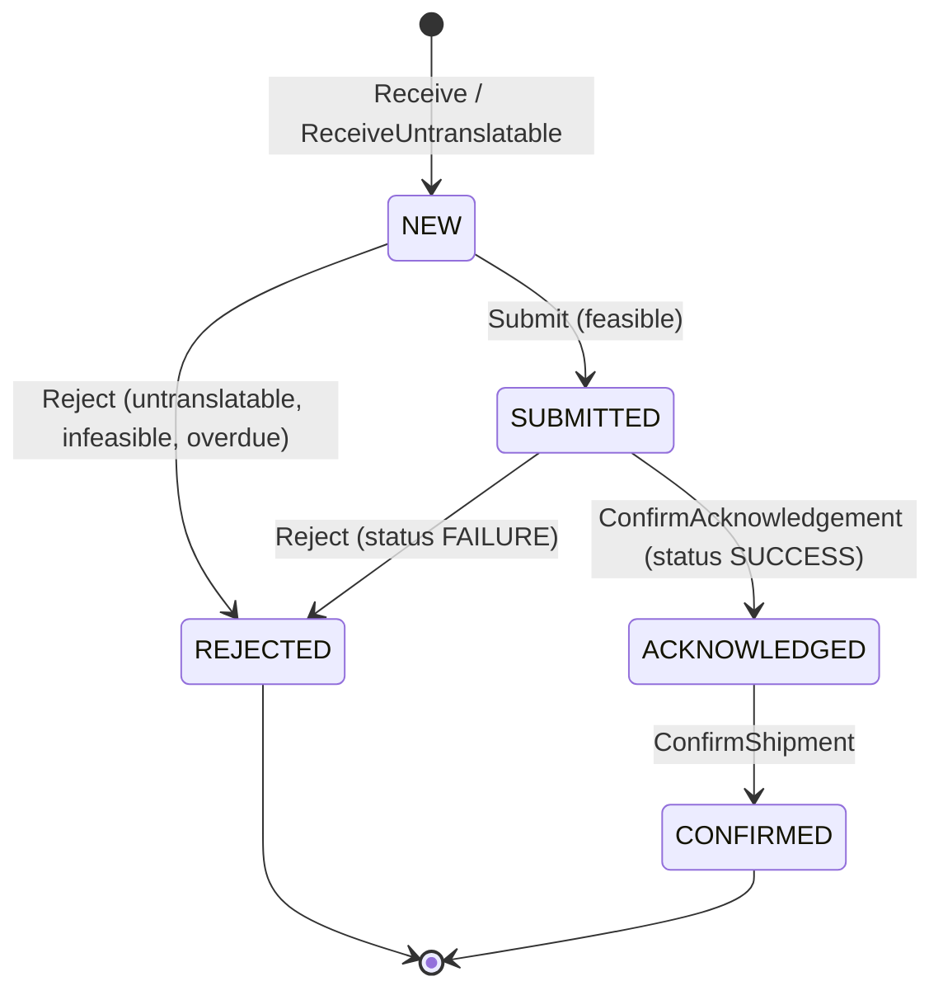

# Application use cases

The six application services in `internal/application/usecases`, as they are
on `develop`: what triggers each one, what it takes, which invariants it
relies on, what it calls and which events it raises. The step-by-step
sequence diagrams are in [sequence-diagrams.md](sequence-diagrams.md); the
event payloads are in
[ecosystem/integration.md](../ecosystem/integration.md#events-published).

Reads are not use cases here. `GET /network-orders`,
`GET /network-orders/{networkRef}`, `GET /capability-offers` and the MCP
tools read the repositories directly (`internal/adapters/inbound/http/server.go`,
`internal/adapters/inbound/mcp/tools.go`).

## Triggers at a glance

| Use case | Trigger | Cadence / entry point | Wired in |
| --- | --- | --- | --- |
| `ReceiveNetworkDemand` | poller (scheduler) | once at start, then every `POLL_INTERVAL` | `cmd/netfulfil/main.go`, `internal/adapters/inbound/poller/poller.go` |
| `ReconcileSubmittedOrders` | ticker | every `POLL_INTERVAL` | `cmd/netfulfil/workers.go` |
| `SweepAcknowledgementDeadlines` | ticker | every `SWEEP_INTERVAL` | `cmd/netfulfil/workers.go` |
| `RejectOverdueOrders` | ticker | every `SWEEP_INTERVAL` (its own ticker) | `cmd/netfulfil/workers.go` |
| `ConfirmNetworkOrderShipment` | REST | `POST /network-orders/{networkRef}/shipment-confirmation` | `internal/adapters/inbound/http/server.go` |
| `RecomputeCapabilityOffers` | ticker | every `RECOMPUTE_INTERVAL`, only with `CAPABILITY_OFFER_ENABLED=true` | `cmd/netfulfil/capability.go` |

No use case is driven by Kafka or by MCP. The two Kafka consumers in
`netfulfil` only fill caches that `RecomputeCapabilityOffers` reads; the
projector's consumer feeds the analytics store, not a use case.

## How Save and Publish commit

Every use case that changes a `NetworkOrder` saves it and publishes its event
inside `atomically(...)` (`unit_of_work.go`). With `DATABASE_URL` and
`EVENT_PUBLISHER=kafka` that is one Postgres transaction that writes the
aggregate row and the `outbox_events` rows (ADR 0003). In every other
configuration the unit of work is nil and the two calls run back to back.
External calls (order-management, the network) are made **outside** that
scope, in a fixed order explained per use case below.

## NetworkOrder lifecycle

Source: `internal/domain/networkorder/network_order.go`.

## ReceiveNetworkDemand

`receive_network_demand.go`. Turns one unit of network demand into an
answered order.

- **Input**: `contract.InboundDemand` from `NetworkGateway.PollDemand`:
  `networkRef`, `siteId`, `requiredShipBy`, `lines[]` (`networkLineRef`,
  `networkProductId`, `quantity`).
- **Steps**:
  1. Idempotency: if an order with this `networkRef` exists, return it
     unchanged. Nothing is re-answered.
  2. Translate every line's `networkProductId` to a SKU through
     `ProductTranslation`. One unknown product rejects the whole order.
  3. Untranslatable: build a lineless order (`ReceiveUntranslatable`), save
     it with `NetworkOrderReceived` (`lineCount: 0`), then reject it with
     `UNTRANSLATABLE_SKU` (below). No order-management call.
  4. Otherwise build the order (`Receive`), save it `NEW` and publish
     `NetworkOrderReceived` in one scope.
  5. `FulfillmentPlanner.RaiseHeldOrder`: `POST /orders` with
     `releaseOnAllocation: false`, `allowPartialShipment: false` and
     `requiredShipBy`. A `promiseDate` means feasible, `null` means not.
  6. Not feasible: `DELETE /orders/{id}` (cancel the hold), `Reject`, save and
     publish `NetworkOrderRejected` (`INFEASIBLE_DEADLINE`) in one scope,
     then `SubmitAcknowledgement(ref, false)`.
  7. Feasible: `Submit` (to `SUBMITTED`), `LinkLocalOrder(id)`, save and
     publish `NetworkOrderSubmitted` in one scope, then
     `SubmitAcknowledgement(ref, true)`. The hold is **not** released here;
     `ReconcileSubmittedOrders` does that once the network settles it.
- **Invariants** (domain): `networkRef` not empty; at least one line
  (`ErrNoLines`) except for the untranslatable constructor; each line has a
  line ref, a product id and a positive quantity; `acknowledgeBy` is
  `receivedAt + 24h` (`AcknowledgementWindow`); `Submit` and `Reject` only
  from `NEW` (`ErrAlreadyAnswered`); a local order can be linked once, and
  only from `SUBMITTED` on.
- **Events**: `NetworkOrderReceived`, then either `NetworkOrderSubmitted` or
  `NetworkOrderRejected` (`UNTRANSLATABLE_SKU` or `INFEASIBLE_DEADLINE`).
- **Failure**: any error is returned to the poller, which logs
  `receive network demand failed`, counts it in `/inbound-status` `failed`
  and keeps the watermark, so the unit is fetched again. Because step 1
  returns an existing order early, an order saved `NEW` before step 5 failed
  is not retried on the next poll: it stays `NEW` until
  `RejectOverdueOrders` rejects it 24 h later (`@known-bug` in
  `features/network_order_intake.feature`).

## ReconcileSubmittedOrders

`reconcile_submitted_orders.go`. Settles orders left `SUBMITTED` (ADR 0001
§5): a successful submit call is only accepted-for-processing.

- **Input**: none; it lists `NetworkOrderRepo.ListSubmitted`.
- **Per order**: `NetworkGateway.SubmissionStatus(ref)`:
  - `SUCCESS`: `ConfirmAcknowledgement` (to `ACKNOWLEDGED`), save and publish
    `NetworkOrderAcknowledged` (v2) in one scope, then
    `POST /orders/{localOrderId}/release`.
  - `FAILURE`: `DELETE /orders/{localOrderId}` first, then `Reject`, save and
    publish `NetworkOrderRejected` (`SUBMISSION_FAILED`).
  - `PENDING` or a lookup error: left for the next pass.
- **Invariants**: `ConfirmAcknowledgement` only from `SUBMITTED`
  (`ErrNotSubmitted`); `Reject` from `NEW` or `SUBMITTED`.
- **Events**: `NetworkOrderAcknowledged` (`...NetworkOrderAcknowledged.v2`)
  or `NetworkOrderRejected`.
- **Failure**: a failure on one order skips it and the pass continues.
  If the release call fails after the `ACKNOWLEDGED` commit, the order is no
  longer `SUBMITTED` and is not retried (see
  [troubleshooting](../operations/troubleshooting.md#network-orders)).

## SweepAcknowledgementDeadlines

`sweep_acknowledgement_deadlines.go`. Reports orders whose 24 h window has
closed unanswered (ADR 0001 §6).

- **Input**: none; it lists `ListUnanswered` (state `NEW`, ordered by
  `acknowledge_by`).
- **Rule**: `AcknowledgementOverdue(now)`: state `NEW` and `now` after
  `acknowledgeBy`.
- **Effect**: publishes `AcknowledgementDeadlineAtRisk` for each overdue
  order. It never changes the aggregate and has no unit of work, so with the
  outbox the event row is written on its own.
- **Events**: `AcknowledgementDeadlineAtRisk`, again on every pass while the
  order stays `NEW` and overdue.
- **Failure**: a publish failure skips that order for this pass.

## RejectOverdueOrders

`reject_overdue_orders.go`. The separate path that actually rejects an order
whose window closed. It never acknowledges late.

- **Input**: none; same `ListUnanswered` listing and the same overdue rule.
- **Per overdue order**: cancel the local hold if one is linked
  (`DELETE /orders/{id}`), `Reject`, save and publish `NetworkOrderRejected`
  (`ACKNOWLEDGEMENT_DEADLINE_MISSED`) in one scope.
- **Events**: `NetworkOrderRejected`.
- **Failure**: one failing order is skipped; the next pass retries it.
- Note from the code: only `NEW` orders are overdue, and a local order is
  linked only from `SUBMITTED` on, so in practice the cancel branch finds no
  linked order. A hold created by a `RaiseHeldOrder` call whose order then
  stayed `NEW` is not cancelled by this use case.

## ConfirmNetworkOrderShipment

`confirm_network_order_shipment.go`, driven by
`POST /network-orders/{networkRef}/shipment-confirmation` (ADR 0014). No
`PackageManifested` consumer exists.

- **Input**: `networkRef` from the path. No body.
- **Steps**: load the order (`404 network-order-not-found` if absent); if it
  is already `CONFIRMED`, return it (`204`, no second event, no second
  network call); otherwise `ConfirmShipment`, save and publish
  `NetworkOrderShipmentConfirmed` in one scope, then
  `NetworkGateway.SubmitShipmentConfirmation`.
- **Invariant**: `ConfirmShipment` only from `ACKNOWLEDGED`
  (`ErrConfirmBeforeAcknowledge`, `409 confirm-before-acknowledge`).
- **Events**: `NetworkOrderShipmentConfirmed`.
- **Failure**: if the gateway call fails after the commit the route answers
  `500 internal-error`; the order is already `CONFIRMED`, so a retry returns
  `204` without calling the gateway again.

## RecomputeCapabilityOffers

`recompute_capability_offers.go` (ADR 0001 §8, ADR 0017). Computes what this
context would advertise per SKU at `SITE_ID`. Opt-in.

- **Input**: none; the SKU list is `ProductTranslation.KnownSKUs` (every SKU
  the dictionary maps to).
- **Per SKU**:
  - `physicalAvailable` = inventory-storage `GET /inventory/{sku}/usable`.
  - `throughputFeasible` = the sum of `RemainingCapacity(pathId, cutoffAt)`
    over the paths eligible for the site's next cutoff
    (`ProcessPathCapability.NextCutoff`), counting only paths whose
    capacity is known. A path is eligible only if its `CycleTimeP95` fits
    the time left to the cutoff; unknown or zero cycle time stays eligible.
    No schedule, or no known capacity, means "unknown". Every path ruled out
    by cycle time is a proven zero.
  - `capabilityoffer.Compute`: `advertisedQuantity = min(physical,
    throughputFeasible)` with basis `THROUGHPUT_CONSTRAINED` when throughput
    is known and lower, else `physical` with basis `PHYSICAL`.
  - `CapabilityOfferRepo.Save` (upsert per `(sku, siteId)`).
- **Invariants** (`capability_offer.go`): SKU and site not empty, quantity
  not negative, advertised never above physical, basis one of the two.
- **Events**: none. The offer is not sent to the network either
  (`SubmitAvailability` is never called).
- **Failure**: an inventory, compute or save error is logged and that SKU is
  skipped; the pass continues.
