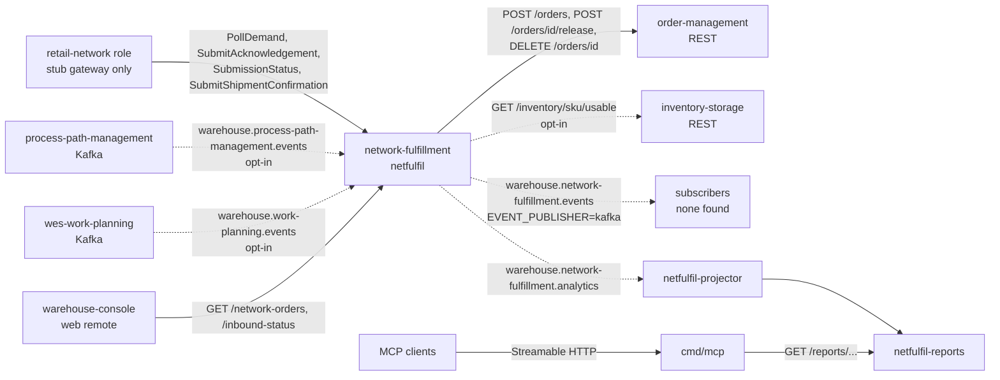

# Integration (upstream and downstream)

Every edge between network-fulfillment and something else, read from the
adapters on `develop`: the protocol, the exact contract (endpoints, topics,
CloudEvents `type`s) and what happens when the other side fails. Edges that
look like they should exist but do not are listed at the end.

The DDD view of the same edges (Conformist, Customer/Supplier, Open Host) is
in [ddd/context-map.md](../ddd/context-map.md). Configuration of each edge is
in [operations/configuration.md](../operations/configuration.md).

Source: `internal/adapters/outbound/network/gateway.go`,
`internal/adapters/outbound/ordermanagement/planner.go`,
`internal/adapters/outbound/inventoryclient/client.go`,
`internal/adapters/outbound/processpathcache/consumer.go`,
`internal/adapters/outbound/pathcapacitycache/consumer.go`,
`internal/adapters/outbound/kafka/publisher.go`,
`internal/adapters/outbound/kafka/analytics_publisher.go`,
`internal/adapters/inbound/mcp/report_tool.go`, `cmd/mcp/main.go`.
Dotted arrows are off by default. Path parameters are written `id` / `sku`
inside the diagram for `{id}` / `{sku}`.

## Summary

| Peer | Direction | Protocol | Contract | Default | On failure |
| --- | --- | --- | --- | --- | --- |
| retail network (`retail-network` plays the role, ADR 0009) | upstream | in-process port `ports.NetworkGateway` | poll demand, submit acknowledgement, submission status, shipment confirmation | stub only | see [The network](#the-network) |
| `order-management` | downstream of our call (we are its Customer) | REST, synchronous | `POST /orders`, `POST /orders/{id}/release`, `DELETE /orders/{id}` | always on | error propagates, one circuit breaker, no retry |
| `inventory-storage` | upstream | REST, synchronous | `GET /inventory/{sku}/usable` | `CAPABILITY_OFFER_ENABLED=true` only | SKU skipped for that recompute pass |
| `process-path-management` | upstream | Kafka, CloudEvents | 4 event types on `warehouse.process-path-management.events` | `CAPABILITY_OFFER_ENABLED=true` only | bad message logged and skipped, no DLQ |
| `wes-work-planning` | upstream | Kafka, CloudEvents | `PathCapacityChanged` on `warehouse.work-planning.events` | `CAPABILITY_OFFER_ENABLED=true` only | bad message logged and skipped, no DLQ |
| any subscriber | downstream | Kafka, CloudEvents | 6 event types on `warehouse.network-fulfillment.events` | `EVENT_PUBLISHER=kafka` only | outbox keeps unsent rows |
| own analytics (`netfulfil-projector`) | internal | Kafka, CloudEvents | same 6 types on `warehouse.network-fulfillment.analytics` | `EVENT_PUBLISHER=kafka` only | retry 3 times, then `.dlq` |
| `warehouse-console` (via `web/` remote) | downstream | REST | `GET /network-orders`, `GET /inbound-status` | on | n/a |
| MCP clients | downstream | MCP, Streamable HTTP | 4 read-only tools | `mcp.enabled` | n/a |

REST and MCP are unauthenticated, like every context in the fleet. Through
Kong the REST API is at `/api/network-fulfillment` and the reports API at
`/api/network-fulfillment/reports`.

## The network

`ports.NetworkGateway` (`internal/application/ports/ports.go`) is the only
route to the external network, and `NETWORK_MODE` picks its implementation
(`internal/adapters/outbound/network/gateway.go`):

- `stub` (default, and any unrecognised value): `StubGateway`, in process
  memory, no network call at all.
- `live`: boot fails. With `NETWORK_BASE_URL` empty the error is
  `NETWORK_MODE=live requires NETWORK_BASE_URL to be set`, otherwise
  `NETWORK_MODE=live is not implemented yet`. There is no live adapter on
  `develop`.

What the stub does for each port method:

| Port method | Called by | Stub behaviour |
| --- | --- | --- |
| `PollDemand(since)` | poller, every `POLL_INTERVAL` | returns every seeded unit still pending; ignores `since` |
| `SubmitAcknowledgement(ref, accepted)` | `ReceiveNetworkDemand` | records the answer and removes the unit from the pending list |
| `SubmissionStatus(ref)` | `ReconcileSubmittedOrders` | `SUCCESS` for a ref this process submitted, `PENDING` otherwise (so after a restart every earlier submission is `PENDING`) |
| `SubmitShipmentConfirmation(ref)` | `ConfirmNetworkOrderShipment` | records it |
| `SubmitAvailability(update)` | nobody yet | records it |
| `DeclareCapability(offer)` | nobody | documented no-op: the real API has no such operation |
| `RequestLabel(ref)` | nobody yet | deterministic fake `{labelRef, trackingNumber, carrier}` |

Demand gets into the stub only from `NETWORK_SEED_FILE` (ADR 0012); the
chart renders it from `stubDemand.demands`. No ship-to PII exists anywhere in
the contract (ADR 0009 §3).

Failure behaviour: a `PollDemand` error is logged (`poll demand failed`) and
the watermark does not move. A unit whose `ReceiveNetworkDemand` fails is
logged and retried on the next poll. A `SubmissionStatus` error leaves the
order `SUBMITTED` for the next pass.

## order-management

Client: `internal/adapters/outbound/ordermanagement/planner.go`, wrapped by
`breaker.go`. Base URL `ORDER_MANAGEMENT_URL` (default
`http://localhost:8080`; the kind overlay sets
`http://order-management.<apps namespace>.svc.cluster.local:80`).

| Call | When | Body / meaning |
| --- | --- | --- |
| `POST /orders` | `ReceiveNetworkDemand`, after the order is saved `NEW` | `{"lines":[{"sku","quantity"}],"releaseOnAllocation":false,"allowPartialShipment":false,"requiredShipBy":"<RFC 3339>"}`. A response with `promiseDate` means feasible; `promiseDate: null` means the deadline cannot be met (a verdict, not an error). The response `id` becomes the order's `localOrderId`. |
| `DELETE /orders/{id}` | rejecting an infeasible order, `SUBMISSION_FAILED`, `RejectOverdueOrders` | cancels the hold and frees the reservations |
| `POST /orders/{id}/release` | `ReconcileSubmittedOrders`, when the network confirms | puts the held order on the floor |

Feasibility is asked, never computed here (ADR 0001 §7). The contract is the
Supplier half in order-management's ADR 0020.

Failure behaviour:

- Any status `>= 300`, transport error or decode error is returned as
  `order-management <METHOD> <path>: status <n>` and fails the use case. No
  call is retried by the client (they are all mutations).
- One gobreaker instance guards all three calls (ADR 0004). It opens after 5
  consecutive failures or more than 50 % failures over at least 10 calls in
  a 30 s window, stays open 30 s, then lets one probe through. While open,
  calls fail with `order-management: circuit breaker open, call not attempted`.
  There is no fallback. The state is the `circuit_breaker_state` gauge on
  `GET /metrics` (see [observability](../operations/observability.md)).
- Each call has a 10 s `http.Client` timeout and a context deadline capped at
  30 s.
- `POST /orders` is sent without an `Idempotency-Key` header on `develop`.
  order-management now requires one, so intake fails with status 400 until
  this repo's open PR #63 lands (see
  [troubleshooting](../operations/troubleshooting.md#network-orders)).

## inventory-storage

Client: `internal/adapters/outbound/inventoryclient/client.go`, base URL
`INVENTORY_STORAGE_URL`. Wired only with `CAPABILITY_OFFER_ENABLED=true`.

- `GET /inventory/{sku}/usable` returns `{"sku","usable"}`; `usable` is the
  physical side of the capability offer. An unknown SKU is `usable: 0` by
  inventory-storage's contract.
- Called by `RecomputeCapabilityOffers` once per known SKU per pass, never on
  a request path.
- Failure: status `>= 300`, transport or decode error is logged as
  `capability offer: usable inventory lookup failed` and that SKU keeps its
  previous offer row until a later pass succeeds. 10 s timeout, no breaker,
  no retry.

Why REST and not a Kafka cache: inventory-storage publishes its stock ledger
only to its analytics topic, and rebuilding its usable-quantity projection
here would duplicate its math (the `ports.InventoryAvailability` doc
comment).

## process-path-management

Consumer: `internal/adapters/outbound/processpathcache/consumer.go`. Wired
only with `CAPABILITY_OFFER_ENABLED=true`.

- Topic `warehouse.process-path-management.events`, read from the earliest
  offset with a group id unique per process
  (`network-fulfillment-process-path-capability-cache-<hostname>-<pid>-<unix-nanos>`).
- CloudEvents types handled:

| `type` | Data fields read | Effect on the cache |
| --- | --- | --- |
| `com.warehouse.wes.process-path-management.processpath.ProcessPathCreated` | `path_id`, `cycle_time_p95` | stores the path's cycle time |
| `com.warehouse.wes.process-path-management.processpath.ProcessPathUpdated` | `path_id`, `cycle_time_p95` | replaces it |
| `com.warehouse.wes.process-path-management.processpath.ProcessPathDeactivated` | `path_id` | forgets the path |
| `com.warehouse.wes.process-path-management.cptschedule.CPTScheduleChanged` | `site_id`, `timezone`, `cutoffs[]` (`cpt_id`, `local_time`, `days_of_week`, `ship_method`, `eligible_path_ids`) | replaces the site's CPT schedule |

- Any other type is ignored. A message that is not a CloudEvent is logged
  (`skipping non-CloudEvents message`) and skipped. No DLQ.
- Simplification in the code: a cutoff's `local_time` is treated as UTC; the
  schedule `timezone` is not applied.
- Boot waits up to 60 s for the cache to catch up with the topic's end
  offset (read from the first broker in `KAFKA_BROKERS`), inside one shared
  120 s budget with the capacity cache. A timeout exits the process.

## wes-work-planning

Consumer: `internal/adapters/outbound/pathcapacitycache/consumer.go`. Wired
only with `CAPABILITY_OFFER_ENABLED=true`.

- Topic `warehouse.work-planning.events`, earliest offset, group id
  `network-fulfillment-path-capacity-cache-<hostname>-<pid>-<unix-nanos>`.
- One type handled:
  `com.warehouse.wes.work-planning.workpool.PathCapacityChanged`, data
  `path_id`, `cutoff_at`, `remaining_units`, `known`. The cache keeps the
  latest figure per `(path_id, cutoff_at)`; `known: false` (no hard
  ceiling) is stored as unknown.
- Other types are ignored, non-CloudEvents are logged and skipped. Same
  60 s ready wait as above.

`RecomputeCapabilityOffers` matches capacity on the exact `cutoff_at`
instant of the site's next cutoff.

## Events published

Only with `EVENT_PUBLISHER=kafka`. With `DATABASE_URL` set every event goes
through the transactional outbox (ADR 0003) and the relay; without it the
publishers write directly. Otherwise events go to the log only.

Envelope (ADR 0008, `internal/adapters/kafka/cloudevents/cloudevents.go`):
CloudEvents 1.0 structured mode, Kafka header
`content-type: application/cloudevents+json; charset=UTF-8`,
`source=/warehouse/network-fulfillment`, `subject=<networkRef>`, Kafka key
`networkRef` with a hash balancer (ADR 0005), `datacontenttype
application/json`, `dataschema
urn:warehouse:network-fulfillment:<events|analytics>:<EventName>:v<N>`.
The `id` is minted once and stored in the outbox row, so a redelivery keeps
it: dedupe on `id`.

Each event is written to both `warehouse.network-fulfillment.events`
(integration) and `warehouse.network-fulfillment.analytics` (this context's
own analytics projector).

| CloudEvents `type` | Schema version | Raised by | `data` fields |
| --- | --- | --- | --- |
| `com.warehouse.wes.network-fulfillment.networkorder.NetworkOrderReceived` | v1 | `ReceiveNetworkDemand`, on receipt (also for untranslatable demand, with `lineCount: 0`) | `networkRef`, `siteId`, `requiredShipBy`, `acknowledgeBy`, `lineCount`, `at` |
| `com.warehouse.wes.network-fulfillment.networkorder.NetworkOrderSubmitted` | v1 | `ReceiveNetworkDemand`, when the order goes `SUBMITTED` | `networkRef`, `siteId`, `localOrderId`, `receivedAt`, `at` |
| `com.warehouse.wes.network-fulfillment.networkorder.NetworkOrderAcknowledged.v2` | v2 | `ReconcileSubmittedOrders`, when the network confirms (`ACKNOWLEDGED`) | `networkRef`, `siteId`, `localOrderId`, `receivedAt`, `at` |
| `com.warehouse.wes.network-fulfillment.networkorder.NetworkOrderRejected` | v1 | `ReceiveNetworkDemand`, `ReconcileSubmittedOrders`, `RejectOverdueOrders` | `networkRef`, `siteId`, `reason` (`UNTRANSLATABLE_SKU`, `INFEASIBLE_DEADLINE`, `ACKNOWLEDGEMENT_DEADLINE_MISSED`, `SUBMISSION_FAILED`), `at` |
| `com.warehouse.wes.network-fulfillment.networkorder.NetworkOrderShipmentConfirmed` | v1 | `ConfirmNetworkOrderShipment` | `networkRef`, `siteId`, `localOrderId`, `at` |
| `com.warehouse.wes.network-fulfillment.networkorder.AcknowledgementDeadlineAtRisk` | v1 | `SweepAcknowledgementDeadlines`, every pass while an order stays overdue and `NEW` | `networkRef`, `siteId`, `acknowledgeBy`, `at` |

`NetworkOrderAcknowledged` v2 means "settled"; before ADR 0016 the v1 type
was published at submission. The projector still counts v1 events left on
the analytics topic. `AcknowledgementDeadlineAtRisk` is level-triggered:
expect repeats. The machine-readable catalogue is `apis/asyncapi.yaml`.

No consumer of `warehouse.network-fulfillment.events` was found in the local
fleet checkouts. The analytics topic's consumer and its DLQ
(`warehouse.network-fulfillment.analytics.dlq`) are described in the
[runbook](../operations/runbook.md#dead-letters).

## REST surface

Served by `cmd/netfulfil` (`internal/adapters/inbound/http/server.go`),
specified in `apis/openapi.yaml`:

| Route | Purpose |
| --- | --- |
| `GET /healthz` | liveness |
| `GET /readyz` | readiness (503 once shutdown starts) |
| `GET /metrics` | Prometheus, the `circuit_breaker_state` gauge |
| `GET /inbound-status` | network mode, poller counters, unanswered and overdue counts |
| `GET /network-orders` | unanswered (`NEW`) orders, soonest deadline first |
| `GET /network-orders/{networkRef}` | one order, any state |
| `POST /network-orders/{networkRef}/shipment-confirmation` | the one write route (ADR 0014): `204`, `404`, `409` |
| `GET /capability-offers` | only with `CAPABILITY_OFFER_ENABLED=true` |

`cmd/netfulfil-reports` serves `GET /reports/acknowledgement`,
`GET /reports/acknowledgement/freshness` and `GET /healthz`; see the
[runbook](../operations/runbook.md#reports-api-netfulfil-reports).

The `web/` Module Federation remote (ADR 0010), loaded by the
`warehouse-console` shell, calls `GET /network-orders` and
`GET /inbound-status`.

## MCP tools

`cmd/mcp` serves four read-only tools, one resource and one prompt over
Streamable HTTP: `get_network_order`, `list_network_orders`,
`list_capability_offers` and `get_acknowledgement_report` (only when
`REPORTS_BASE_URL` is set). There is no write tool. Inputs, outputs and
annotations: [mcp/tools.md](../mcp/tools.md).

## Edges that do not exist

- **No live network.** Only the stub gateway exists; `NETWORK_MODE=live`
  refuses to boot.
- **No `PackageManifested` consumer** from `fulfillment-execution`. Shipment
  confirmation is an explicit REST call (ADR 0014) because there is no
  persisted `WorkUnitId -> NetworkRef` mapping.
- **Capability offers are not sent to the network.** `SubmitAvailability`
  exists on the port, but no use case calls it.
- **No call to `product-master`** or any other context not listed above.
