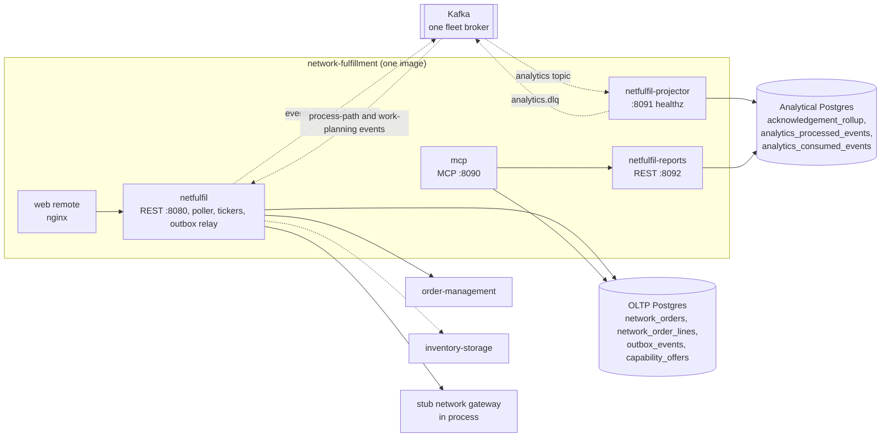

# Architecture

network-fulfillment is a hexagonal (ports and adapters) Go service. One
repository builds four binaries into one image; a Helm chart deploys them
plus the `web/` remote. Everything below is read from `cmd/`, `internal/`
and `charts/network-fulfillment` on `develop`.

## Binaries

| Binary | Role | Listens on | Reads / writes | Deployment (chart) |
| --- | --- | --- | --- | --- |
| `cmd/netfulfil` | OLTP service: REST API, inbound poller, four tickers, outbox relay, optional capability-offer pipeline | `:8080` (`PORT`); Service 80 -> 8080 | OLTP Postgres (`DATABASE_URL`, optional), Kafka (optional), order-management, inventory-storage | `network-fulfillment` |
| `cmd/mcp` | read-only MCP server, Streamable HTTP at `/` and `/mcp`, `GET /healthz` | `:8090` (`MCP_ADDR`) | the same OLTP Postgres, read only; `netfulfil-reports` over REST | `network-fulfillment-mcp` (`mcp.enabled`) |
| `cmd/netfulfil-projector` | analytics writer: consumes `warehouse.network-fulfillment.analytics` into the analytical database, DLQ on failure | `:8091` (`ADMIN_ADDR`), `GET /healthz` only | analytical Postgres (`ANALYTICS_DATABASE_URL`), Kafka | `network-fulfillment-projector` (`analytics.enabled`) |
| `cmd/netfulfil-reports` | analytics reader: `GET /reports/acknowledgement`, `.../freshness` | `:8092` (`HTTP_ADDR`); Service 80 -> 8092 | analytical Postgres, read-only pool | `network-fulfillment-reports` (`analytics.enabled`) |
| `web/` (nginx) | Module Federation remote for `warehouse-console` (ADR 0010) | 8080 | the REST API through Kong | `network-fulfillment-frontend` (`frontend.enabled`) |

The image's entrypoint is `./netfulfil`; the chart starts the other three
with an explicit command. Probes, replicas and HPA are in the
[runbook](../operations/runbook.md#deployables); every env var is in
[configuration](../operations/configuration.md).

## Containers



Source: `cmd/netfulfil/main.go`, `cmd/netfulfil/capability.go`,
`cmd/netfulfil/publishing.go`, `cmd/mcp/main.go`,
`cmd/netfulfil-projector/main.go`, `cmd/netfulfil-reports/main.go`,
`migrations/`, `migrations/analytics/`,
`charts/network-fulfillment/templates/`. Dotted edges are off by default
(`EVENT_PUBLISHER=kafka`, `CAPABILITY_OFFER_ENABLED=true`). The gateway sits
inside the `netfulfil` process because only the stub exists.

## Hexagonal layout

```text
internal/
  domain/                      pure model, no I/O
    networkorder/              NetworkOrder aggregate and its lifecycle
    capabilityoffer/           CapabilityOffer aggregate (advertised quantity)
    shared/                    value types (NetworkRef, SKU, SiteId, ...) and domain events
  application/
    contract/                  plain data crossing the ports (InboundDemand, HeldOrderRequest, NextCutoff, ...)
    ports/                     OUT ports, interfaces only
    usecases/                  the six application services
  adapters/
    inbound/http/              REST routes, RFC 7807 errors, readiness, reports router
    inbound/poller/            the inbound leg: polls the gateway, feeds ReceiveNetworkDemand
    inbound/mcp/               MCP tools, resource, prompt
    inbound/kafka/             analytics consumer (own topic) + DLQ
    kafka/cloudevents/         the CloudEvents 1.0 envelope, shared by every publisher and consumer
    outbound/network/          NETWORK_MODE switch, stub gateway, seed file
    outbound/ordermanagement/  held-order REST client + circuit breaker
    outbound/inventoryclient/  usable-quantity REST client
    outbound/processpathcache/ Kafka cache: path cycle times + CPT schedule
    outbound/pathcapacitycache/ Kafka cache: remaining path capacity
    outbound/kafka/            integration + analytics publishers
    outbound/eventwire/        JSON wire shape of each domain event
    outbound/postgres/         repositories, outbox publisher and relay, unit of work, migrations runner
    outbound/memory/           in-memory repositories, product translation file
    outbound/analyticsstore/   analytical projection and report store
    outbound/events/           log publisher (the default)
    outbound/telemetry/        OTLP setup, circuit-breaker gauge
  analytics/report/            report catalogue and ports for the reports binary
  resilience/                  breaker settings, call timeout
  architecture/                fitness tests that enforce all of the above
```

Rules enforced by `internal/architecture` (run with `make arch-test`):
the domain imports nothing from `application` or `adapters`; `application`
imports no adapter; `ports` holds interfaces only; domain events carry no
struct tags (their JSON lives in `eventwire`); the CloudEvents `type`
service segment equals the module name. See
[testing](../development/testing.md#architecture-fitness-tests).

## Ports and their adapters

| Port (`internal/application/ports`) | Adapters | Chosen by |
| --- | --- | --- |
| `NetworkOrderRepo` | `postgres.NetworkOrderRepo`, `memory.NetworkOrderRepo` | `DATABASE_URL` set or not |
| `CapabilityOfferRepo` | `postgres.CapabilityOfferRepo`, `memory.CapabilityOfferRepo` | same |
| `NetworkGateway` | `network.StubGateway` (live not implemented) | `NETWORK_MODE` |
| `FulfillmentPlanner` | `ordermanagement.BreakerClient` wrapping `Planner` | always |
| `ProductTranslation` | `memory` dictionary loaded from `PRODUCT_TRANSLATION_FILE` | always (empty without the file) |
| `ProcessPathCapability` | `processpathcache.Consumer` | `CAPABILITY_OFFER_ENABLED=true` |
| `PathCapacity` | `pathcapacitycache.Consumer` | same |
| `InventoryAvailability` | `inventoryclient.Client` | same |
| `EventPublisher` | `events` log publisher; `kafka` direct publishers; `postgres.OutboxPublisher` | `EVENT_PUBLISHER`, `DATABASE_URL` |
| `UnitOfWork` | `postgres.UnitOfWork`, or nil | `DATABASE_URL` set (a real transaction, which also holds the outbox rows when `EVENT_PUBLISHER=kafka`) |
| `Clock` | system clock (UTC) | always |

## Data stores

**OLTP Postgres** (`DATABASE_URL`, optional), migrations `migrations/0001`
to `0004`, applied by `netfulfil` and by `mcp` at startup:

| Table | Holds |
| --- | --- |
| `network_orders` | one row per `NetworkOrder` (ref, site, deadlines, state, local order id) |
| `network_order_lines` | its lines, both vocabularies |
| `outbox_events` | CloudEvent bytes waiting for (or already sent by) the relay |
| `capability_offers` | latest offer per `(sku, site_id)` |

**Analytical Postgres** (`ANALYTICS_DATABASE_URL`, required by projector and
reports), migrations `migrations/analytics/0001` and `0002`, applied by the
projector:

| Table | Holds |
| --- | --- |
| `acknowledgement_rollup` | per-day counters behind the acknowledgement report |
| `analytics_processed_events` | event ids the projection has applied, with each event's business time (the source of the freshness lag) |
| `analytics_consumed_events` | the consumer's own dedupe set, checked before the projection runs |

Column-level ER diagrams: [ddd/entity-relationship.md](../ddd/entity-relationship.md).

**Kafka** (one fleet broker): produces `warehouse.network-fulfillment.events`
and `warehouse.network-fulfillment.analytics`, the projector produces
`warehouse.network-fulfillment.analytics.dlq`, and `netfulfil` consumes
`warehouse.process-path-management.events` and
`warehouse.work-planning.events` when capability offers are on. Topics and
group ids: [runbook](../operations/runbook.md#kafka).

## Request and event flows

- Demand: poller -> `ReceiveNetworkDemand` -> order-management held order ->
  answer to the network. Settlement by `ReconcileSubmittedOrders`.
- Shipment: `POST /network-orders/{networkRef}/shipment-confirmation` ->
  `ConfirmNetworkOrderShipment`.
- Events: use case -> `outbox_events` (same transaction) -> relay -> both
  topics -> projector -> analytical tables -> reports API -> MCP report tool.

Per-use-case detail: [ddd/use-cases.md](../ddd/use-cases.md) and
[ddd/sequence-diagrams.md](../ddd/sequence-diagrams.md). Edges to other
contexts: [ecosystem/integration.md](../ecosystem/integration.md).

## Telemetry

Only `netfulfil` calls `telemetry.Setup`: OTLP/gRPC traces and metrics to
`OTEL_EXPORTER_OTLP_ENDPOINT` (ADR 0019), plus the Prometheus
`circuit_breaker_state` gauge on `GET /metrics`. The other three binaries log
JSON and export nothing. See [observability](../operations/observability.md).
